<p align="center">
  
  
  
  
  
</p>

<h1 align="center">🖥️ Code Proxy · Admin Dashboard</h1>

<p align="center">
  <strong>The official frontend management panel for <a href="https://github.com/kittors/CliRelay">CliRelay (CLI Proxy API)</a></strong>
</p>

<p align="center">
  <em>Monitor, manage, and configure your CLI proxy channels — all from a modern web UI.</em>
</p>

<p align="center">
  <a href="https://github.com/kittors/codeProxy/stargazers"></a>
  <a href="https://github.com/kittors/codeProxy/network/members"></a>
  <a href="https://github.com/kittors/codeProxy/issues"></a>
  <a href="https://github.com/kittors/codeProxy/blob/main/LICENSE"></a>
</p>

---

## ✨ Overview

**Code Proxy** is the official web-based admin panel for [**CliRelay**](https://github.com/kittors/CliRelay) — a proxy server that wraps Claude Code, Gemini CLI, OpenAI Codex, Qwen, iFlow, Kimi, Antigravity, xAI/Grok, OpenCode Go, ClinePass, Ollama Cloud, Bedrock, Vertex, Amp, and OpenAI-compatible upstreams behind one managed API layer.

This dashboard provides a complete management interface for your AI proxy infrastructure:

- 📊 **Dashboard** — KPI cards, health score, live system stats, throughput, storage, and latency ranking
- 📈 **Monitor Center** — model distribution, daily trends, token/request charts, and API Key filters
- 📋 **Request Logs** — dense request table, saved filters, body/content viewer, error details, and export helpers
- 🔗 **Provider Workspace** — Gemini, Claude, Codex, OpenCode Go, ClinePass, Ollama Cloud, Vertex, Bedrock, OpenAI-compatible, and Ampcode tabs
- 🗂️ **Auth Files** — OAuth/auth inventory with model access, proxy binding, tags, quota snapshots, health states, and download actions
- 🔑 **API Keys & Permissions** — key CRUD, quotas, RPM/TPM, channel group bindings, model restrictions, and reusable permission profiles
- 🧭 **Routing & Imports** — channel groups, custom path routing, CC Switch import settings, and public quick-import data
- 🎨 **Image Generation** — image-capable channel selection, size presets, and test task polling
- 🎯 **Models** — custom model catalog, owner presets, OpenRouter sync, pricing, and availability
- 🔍 **API Key Lookup** — public self-service usage, chart, log, model, and quick-import pages
- ⚙️ **Operations** — visual/YAML config editor, proxy pool, system info, online update prompt, live logs, dark mode, and i18n

## 📸 Screenshots

The gallery below uses the latest 21 supplied management-panel screenshots.

### Dashboard & Monitoring

| Dashboard overview | System health |
| :----------------- | :------------ |
| 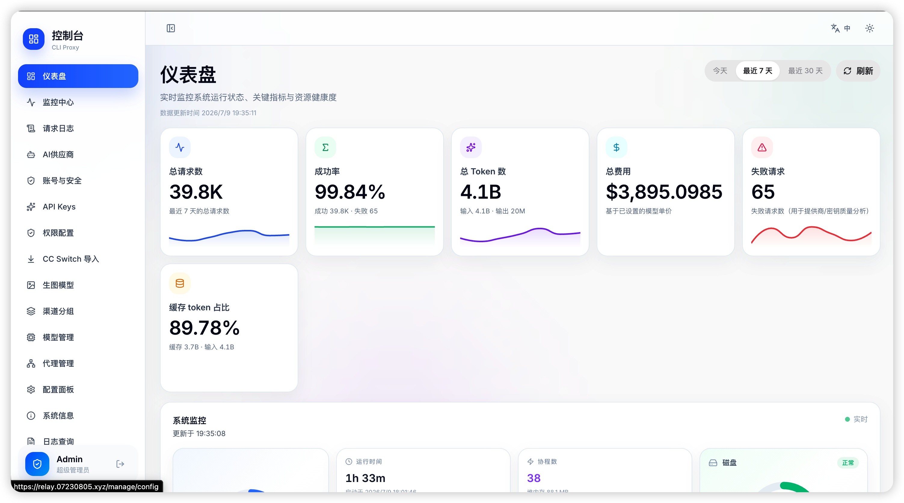 |  |

| Traffic trend | Monitor summary |
| :------------ | :-------------- |
| 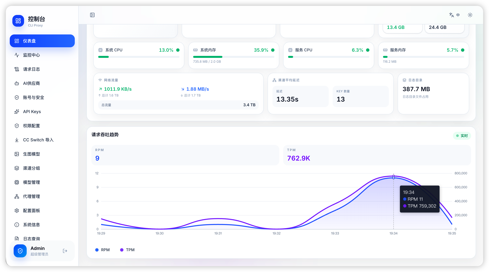 |  |

| Monitor breakdown | Request logs |
| :---------------- | :----------- |
| 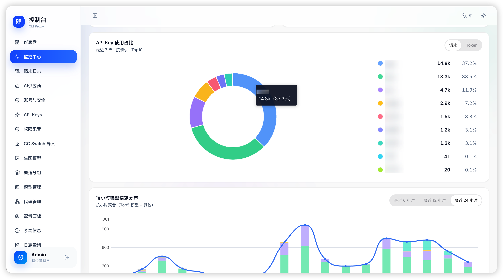 |  |

| Request details | Public API key lookup |
| :-------------- | :-------------------- |
| 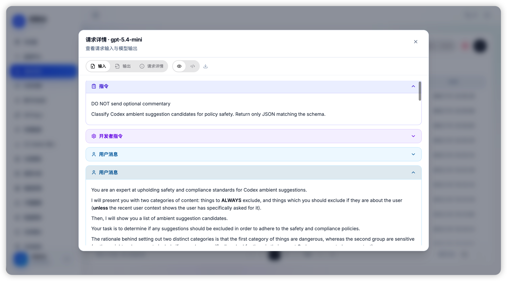 |  |

### Providers, Auth & Access

| OpenCode Go auth files | Claude auth files |
| :--------------------- | :---------------- |
| 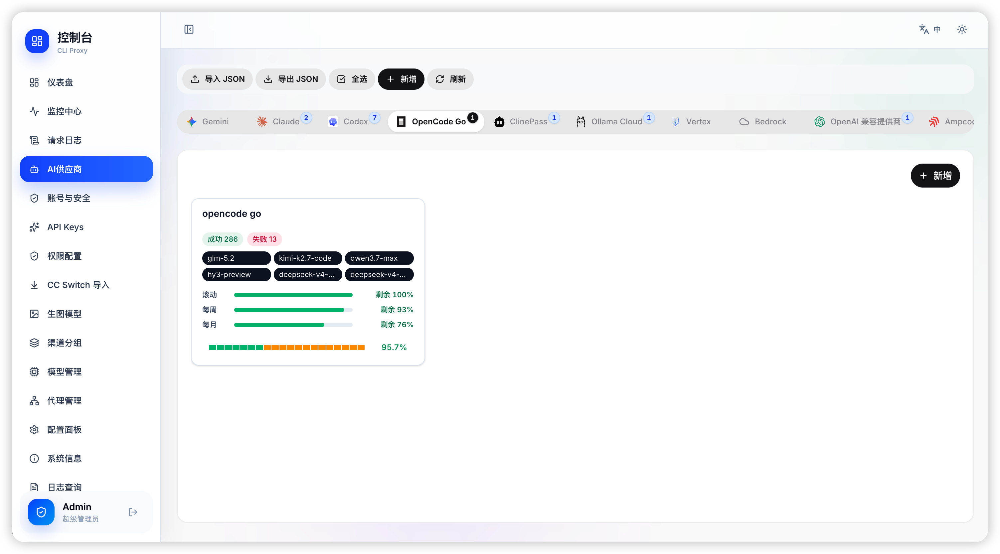 |  |

| Claude OAuth health | API keys |
| :------------------ | :------- |
|  | 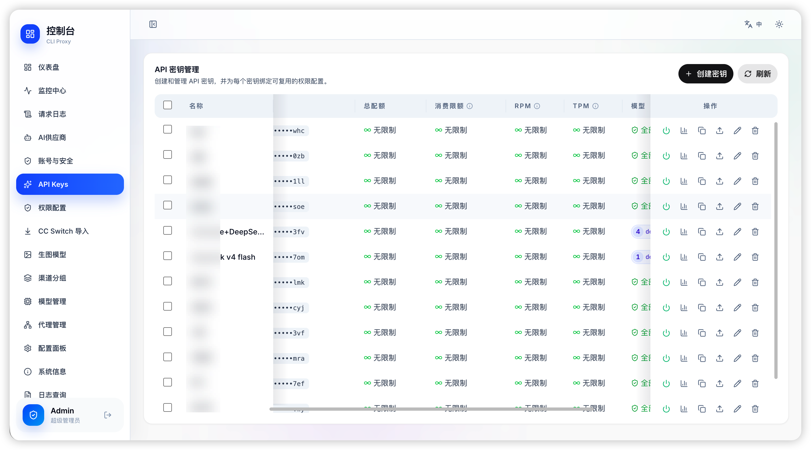 |

| API key permissions | Proxy pool |
| :------------------ | :--------- |
| 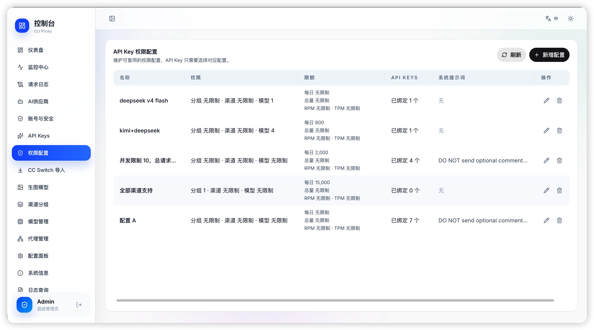 |  |

### Routing, Models & Configuration

| CC Switch import | Image generation |
| :--------------- | :--------------- |
| 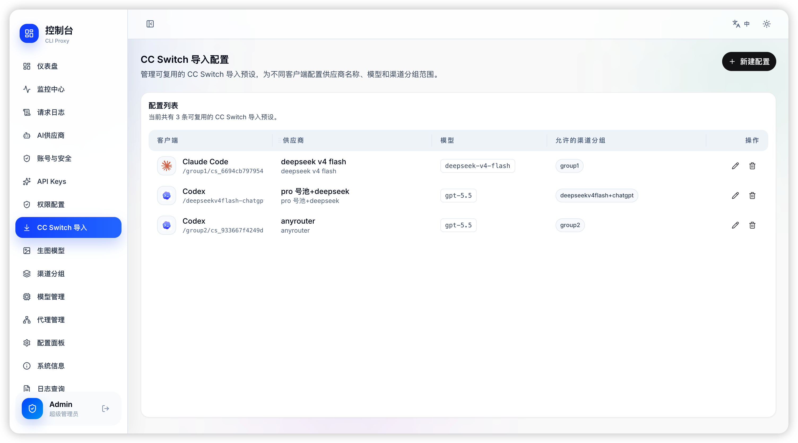 |  |

| Channel groups | Models |
| :------------- | :----- |
| 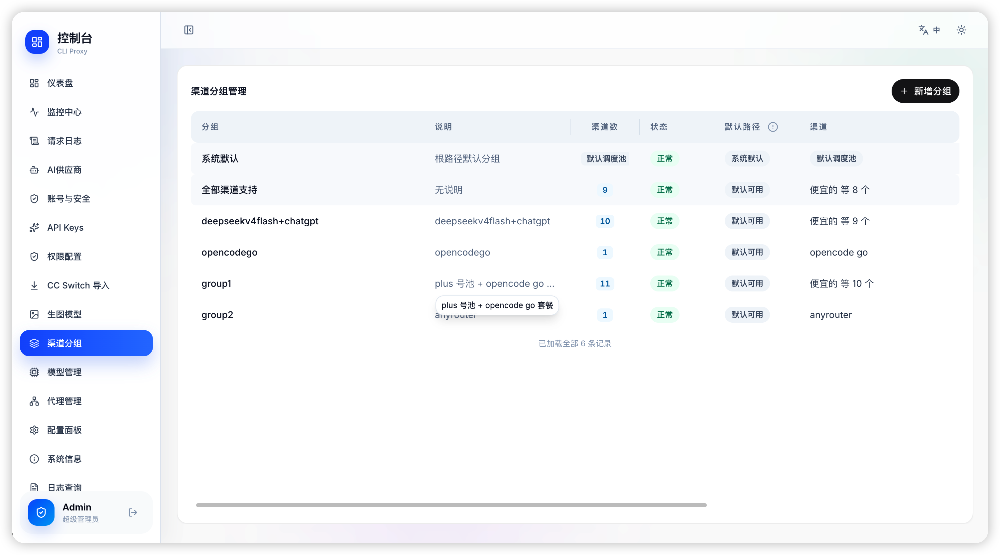 | 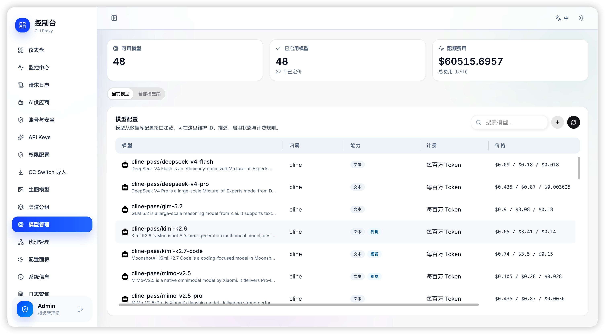 |

| Config | System |
| :----- | :----- |
|  | 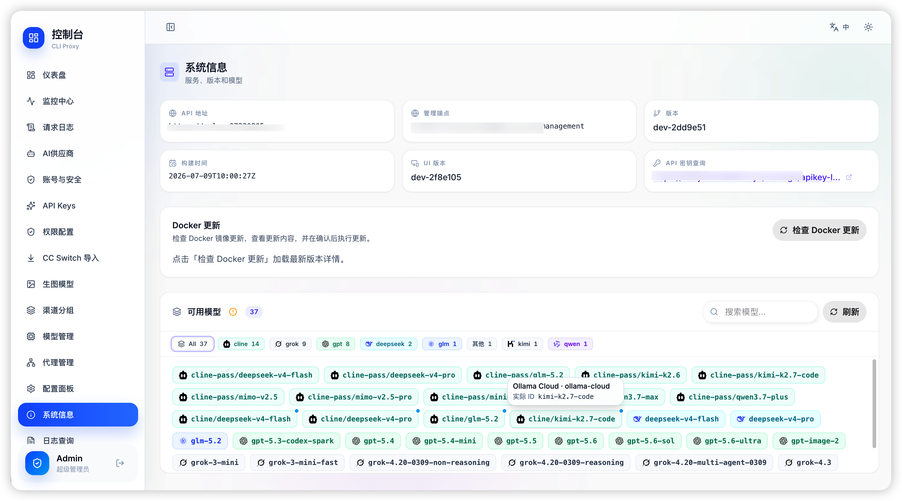 |

| Live logs |
| :-------- |
|  |

## 🧩 Feature Details

### 📊 Dashboard

| Module              | Description                                                                            |
| :------------------ | :------------------------------------------------------------------------------------- |
| **KPI Cards**       | Total requests, success rate, token consumption, failed request count (7-day / 30-day) |
| **Health Score**    | Real-time circular gauge (0–100) evaluating overall system health                      |
| **System Monitor**  | WebSocket-powered live stats: uptime, goroutines, CPU, memory, network I/O, DB size    |
| **Channel Latency** | Top 5 channel average latency with visual bar indicators                               |
| **Resource Bars**   | System CPU, memory, service CPU, memory, database size — color-coded status            |

### 📈 Monitor Center

| Module                 | Description                                                                       |
| :--------------------- | :-------------------------------------------------------------------------------- |
| **KPI Summary**        | Total requests, success rate, total/output tokens with time range selection       |
| **Model Distribution** | Interactive donut chart showing Top 10 model usage by request count or token      |
| **Daily Trends**       | Dual-axis chart with input/output tokens (bar) and request count (line) over time |
| **Hourly Heatmap**     | Stacked bar chart showing per-model hourly request distribution (6h / 12h / 24h)  |
| **API Key Filter**     | Filter all metrics by specific API Key prefix                                     |

### 📋 Request Logs

| Module             | Description                                                                 |
| :----------------- | :-------------------------------------------------------------------------- |
| **Virtual Table**  | High-density log browsing with stored column order and pagination controls  |
| **Multi-Filter**   | Filter by API Key, model, status, channel, auth subject, and time range     |
| **Content Viewer** | Fetch request/response bodies from `/usage/logs/:id/content` on demand      |
| **Error Details**  | Open failed rows directly into provider error details                       |
| **Public Logs**    | Same log/content workflow is available through the public API Key lookup    |

### 🔗 AI Providers

| Module              | Description                                                                                                     |
| :------------------ | :-------------------------------------------------------------------------------------------------------------- |
| **Multi-Tab**       | Gemini, Claude, Codex, OpenCode Go, ClinePass, Ollama Cloud, Vertex, Bedrock, OpenAI Compatible, Ampcode tabs   |
| **Channel Cards**   | Name, masked key, base URL, model count, success/fail stats, latency, proxy pool binding, and status badges     |
| **CRUD / Patch**    | Add, edit, patch, delete channels with headers, aliases, excluded models, Bedrock auth mode, and provider extras |
| **Model Access**    | Per-provider model access controls and availability derived from backend model definitions                       |

### 🗂️ Auth, Keys & Routing

| Module                    | Description                                                                 |
| :------------------------ | :-------------------------------------------------------------------------- |
| **Auth Files**            | OAuth/auth inventory, tags, quota snapshots, identity summaries, and health |
| **API Keys**              | Client key CRUD with quotas, rate limits, model filters, and group bindings |
| **Permission Profiles**   | Reusable API Key restrictions across providers, groups, and models          |
| **Channel Groups**        | Group routing plus custom path namespaces for team or workload routing      |
| **CC Switch Import**      | Public/importable model and group mapping settings for compatible clients   |
| **Proxy Pool**            | Reusable outbound proxy entries with backend health checks                  |

### 🔍 API Key Lookup

| Module           | Description                                                                 |
| :--------------- | :-------------------------------------------------------------------------- |
| **Self-Service** | Public page for end users to check API Key usage without admin login        |
| **Usage Stats**  | Per-key KPI cards, model distribution, heatmap, and trend charts            |
| **Request Logs** | Per-key request history and body viewer through public management endpoints |
| **Quick Import** | Public CC Switch import metadata for compatible clients                     |

## 🛠️ Tech Stack

| Category             | Technology                                     |
| :------------------- | :--------------------------------------------- |
| **Framework**        | React 19.2.4 + TypeScript 5.9.3                                         |
| **Build Tool**       | Vite 7.3.1 + `@vitejs/plugin-react` 5.1.4                                |
| **Package Manager**  | Bun 1.2.2                                                                |
| **Styling**          | Tailwind CSS 4.1.18, Sass, shared `@code-proxy/ui` primitives            |
| **Routing**          | React Router DOM 7.13 with lazy page preload                             |
| **Data / HTTP**      | Axios 1.13, typed endpoint wrappers, WebSocket system stats               |
| **Charts**           | Apache ECharts 6, `echarts-for-react`, Chart.js 4, `react-chartjs-2`      |
| **Content Rendering** | `react-markdown`, `remark-gfm`, `react-syntax-highlighter`, YAML parser  |
| **UI Libraries**     | Lucide React 0.563, Radix Dropdown Menu, TanStack Virtual, goey-toast     |
| **Quality**          | Vitest 4, Playwright 1.58, Testing Library, oxlint 1.46, oxfmt 0.31      |

## 🚀 Getting Started

### Prerequisites

- [Bun](https://bun.sh/) ≥ 1.2 (or Node.js ≥ 18)
- A running [CliRelay](https://github.com/kittors/CliRelay) backend instance

### Install & Run

```bash
# Clone the repository
git clone https://github.com/kittors/codeProxy.git
cd codeProxy

# Install dependencies
bun install

# Start dev server
bun run dev
```

The dashboard will be available at **http://localhost:5173/**

### Build for Production

```bash
# Type-check & build
bun run build

# Preview production build
bun run preview
```

### Quality Checks

Pull requests to `dev` and `main` run lint, low-concurrency Vitest, build, and bundle diff in GitHub Actions. The frontend package manager is Bun (`packageManager: bun@1.2.2`); use `bun run ...` commands for local spot checks and leave full CI validation to GitHub Actions when local hardware is constrained.

## 📁 Project Structure

```
apps/admin-panel/       # Vite application shell, router, guards, layout, bootstrap, global styles
pages/                  # Route-level screens and page-private components/hooks
features/               # Cross-page UI workflows such as log viewer, OAuth, routing editor
packages/
├── api-client/         # Management API client, endpoint DTOs, request helpers
├── assets/             # Vendor icons and shared static assets
├── domain/             # Pure business logic, normalizers, formatters, pricing/quota helpers
├── i18n/               # i18next setup and locale resources
├── test-utils/         # Shared test utilities
└── ui/                 # Shared UI primitives, overlays, DataTable, charts, theme
tooling/                # Vite plugins and build-time helpers
scripts/                # Repository checks, including import boundary validation
```

## 🔌 API Integration

This dashboard communicates with the CliRelay backend via the Management API:

| Endpoint                                  | Method            | Description                         |
| :---------------------------------------- | :---------------- | :---------------------------------- |
| `/v0/management/config`                   | `GET`             | Verify login & fetch configuration  |
| `/v0/management/config.yaml`              | `GET/PUT`         | Read or save YAML runtime config    |
| `/v0/management/update/*`                 | `GET/POST`        | Version checks and online update    |
| `/v0/management/usage`                    | `GET`             | Usage statistics summary            |
| `/v0/management/usage/export`             | `GET`             | Export usage statistics             |
| `/v0/management/usage/import`             | `POST`            | Import usage statistics             |
| `/v0/management/usage/logs`               | `GET/DELETE`      | Request log history and cleanup     |
| `/v0/management/usage/logs/:id/content`   | `GET`             | Full request/response message body  |
| `/v0/management/usage/chart-data`         | `GET`             | Monitor and lookup chart data       |
| `/v0/management/api-keys`                 | `GET/PUT/PATCH/DELETE` | Client API Key CRUD             |
| `/v0/management/api-key-permission-profiles` | `GET/PUT`      | API Key permission profiles         |
| `/v0/management/*-api-key`                | `GET/PUT/PATCH/DELETE` | Provider key CRUD for Gemini, Claude, Codex, Vertex, Bedrock, OpenCode Go, ClinePass, and Ollama Cloud |
| `/v0/management/openai-compatibility`     | `GET/PUT/PATCH/DELETE` | OpenAI-compatible provider CRUD |
| `/v0/management/auth-files`               | `GET/POST/DELETE` | OAuth/auth file inventory           |
| `/v0/management/auth-files/status`        | `PATCH`           | Enable/disable auth files           |
| `/v0/management/auth-files/fields`        | `PATCH`           | Patch auth file metadata            |
| `/v0/management/*-auth-url`               | `GET/POST`        | Provider OAuth launchers            |
| `/v0/management/model-configs`            | `GET/POST/PUT/DELETE` | Custom model catalog            |
| `/v0/management/model-openrouter-sync`    | `GET/PUT`         | OpenRouter model sync settings      |
| `/v0/management/model-openrouter-sync/run` | `POST`           | Run OpenRouter model sync           |
| `/v0/management/routing-config`           | `GET/PUT`         | Channel groups and custom paths     |
| `/v0/management/identity-fingerprint`     | `GET/PUT`         | Provider identity fingerprints      |
| `/v0/management/identity-fingerprint/learned` | `DELETE`      | Clear learned identity fingerprints |
| `/v0/management/ccswitch-import-configs`  | `GET/PUT`         | CC Switch import settings           |
| `/v0/management/proxy-pool`               | `GET/PUT/PATCH`   | Reusable outbound proxy entries     |
| `/v0/management/proxy-pool/check`         | `POST`            | Probe outbound proxy health         |
| `/v0/management/image-generation/*`       | `GET/PUT/POST`    | Image generation channels and tests |
| `/v0/management/logs`                     | `GET/DELETE`      | Runtime log viewer                  |
| `/v0/management/public/*`                 | `GET/POST`        | API Key lookup and public import data |
| `/v0/management/system-stats`             | `GET`             | System monitoring snapshot          |
| `/v0/management/system-stats/ws`          | `WebSocket`       | Real-time system monitoring         |

> **Note:** The API base is automatically normalized to `{apiBase}/v0/management`

For full backend API documentation, see the [CliRelay Management API](https://help.router-for.me/management/api).

## 🤝 Contributing

Contributions are welcome! Please feel free to submit a Pull Request.

1. Fork the repository
2. Create your feature branch (`git checkout -b feature/amazing-feature`)
3. Commit your changes (`git commit -m 'Add some amazing feature'`)
4. Push to the branch (`git push origin feature/amazing-feature`)
5. Open a Pull Request

## 📄 Related Projects

- **[CliRelay](https://github.com/kittors/CliRelay)** — The backend proxy server (Go)
- **[CliRelay Guides](https://help.router-for.me/)** — Official documentation

## 📝 License

This project is open source. See the [LICENSE](LICENSE) file for details.

---

<p align="center">
  Made with ❤️ for the <a href="https://github.com/kittors/CliRelay">CliRelay</a> community
</p>
